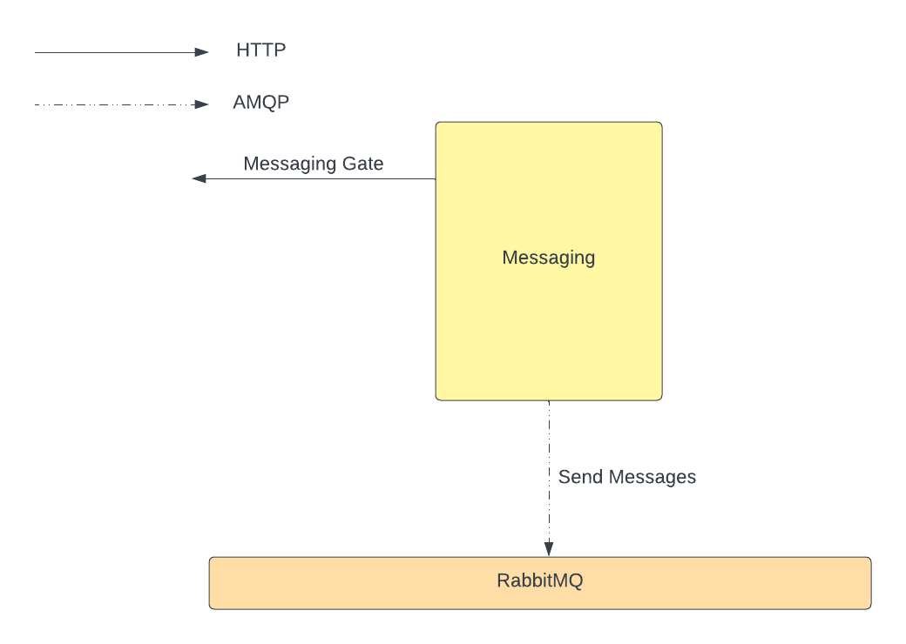

# LeLuChat_Messaging
This is a Microservice of LeLuChat project, that implements websocket with django channels which 
enable WebsiteUser to chat with LeLuUsers. This project is a part of whole LeLuchat 
project. You can follow it [here](https://github.com/amnik-open/LeLuChat).
## Development Environment
### Build Docker Image
`docker compose build`

### Run Development Server
`docker compose up`

